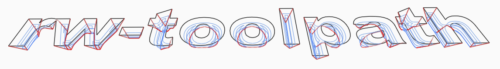
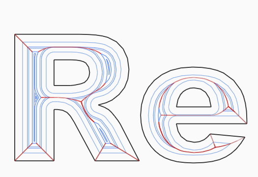
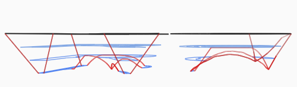
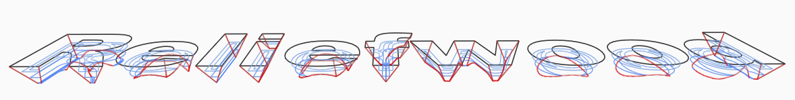
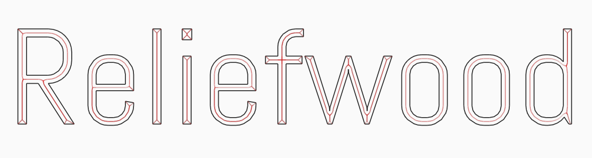

# RW.Toolpaths

<p align="center">
    
</p>

Geometry, medial axis, and CNC toolpath generation for .NET 8.

RW.Toolpaths is a .NET 8 geometry and CNC toolpath library for pocket clearing, V-carve planning, and medial-axis driven path generation. It is built for modern .NET and .NET Core workflows, with a companion Avalonia desktop app for previewing and debugging output.

Project website: [reliefwood.com](https://reliefwood.com)

At the core of the project is a pipeline that combines Clipper-based polygon processing with an optional native Boost.Polygon Voronoi provider. If you are looking for a C# or .NET library related to medial axis computation, Voronoi-based toolpath planning, Boost Voronoi interop, or V-carve path generation, this repository is the relevant entry point.

## What This Project Covers

RW.Toolpaths is aimed at problems that show up in CAM, computational geometry, and CNC automation work:

- Medial axis and Voronoi-based path planning for V-carve workflows.
- Offset and orbit-style pocket clearing for closed polygon regions.
- Toolpath tagging for pass-aware routing, ordering, and downstream export.
- Native Boost Voronoi integration from .NET through a small C interop layer.
- Geometry preview and debugging with a desktop UI.

## Highlights

- Offset pocket filling with concentric inward rings.
- V-carve planning built on a medial-axis pipeline.
- Tagged toolpath output for downstream routing and pass-aware processing.
- Ramp entry helpers for helical and zig-zag lead-ins.
- Native Boost.Polygon Voronoi interop for higher-quality medial-axis generation.
- Desktop preview app for inspecting geometry and generated paths.

## Preview Screenshots

These previews come from the companion Avalonia frontend and show the geometry outline, medial-axis driven carving structure, and generated path behavior.









## Project Structure

| Path | Purpose |
| --- | --- |
| `RW.Toolpaths/` | Core library and native interop wrapper |
| `RW.Toolpaths.Tests/` | xUnit test suite |
| `RW.Toolpaths.Avalonia/` | Desktop preview and debugging frontend |
| `RW.Toolpaths/native/` | CMake-based native Boost Voronoi wrapper |

## Requirements

- .NET 8 SDK
- CMake 3.16+ if you want to build the native Voronoi provider
- A C++17 compiler if you want to build the native Voronoi provider
- Boost headers for native builds

## Quick Start

Clone the repo, restore dependencies, and build the solution:

```powershell
dotnet restore .\RW.Toolpaths.sln
dotnet build .\RW.Toolpaths.sln
```

Run the test suite:

```powershell
dotnet test .\RW.Toolpaths.Tests\RW.Toolpaths.Tests.csproj
```

Launch the desktop preview app:

```powershell
dotnet run --project .\RW.Toolpaths.Avalonia\RW.Toolpaths.Avalonia.csproj
```

## Native Voronoi Provider

`BoostVoronoiProvider` relies on a native library built from the wrapper in `RW.Toolpaths/native`.

This is the part of the repository that connects .NET to Boost.Polygon Voronoi. The managed side prepares segment-site inputs, invokes the native wrapper through P/Invoke, and converts the resulting Voronoi graph into filtered medial-axis segments used by the V-carve pipeline.

Build it from the core project directory:

```powershell
dotnet msbuild .\RW.Toolpaths\RW.Toolpaths.csproj -t:BuildBoostVoronoi
```

If Boost is already installed somewhere custom, pass the include directory explicitly:

```powershell
dotnet msbuild .\RW.Toolpaths\RW.Toolpaths.csproj -t:BuildBoostVoronoi -p:BoostIncludeDir=C:\local\boost_1_87_0
```

Platform notes:

- Windows: the setup script can download and extract Boost headers into a local cache when they are not already installed.
- Linux and macOS: the setup script prefers system Boost headers and will try the system package manager when available.
- Built native binaries are installed under `RW.Toolpaths/runtimes/` and copied into project outputs when present.

## Usage

### Offset Fill

```csharp
using RW.Toolpaths;
using Clipper2Lib;

var boundary = new List<List<PointD>>
{
    new() { new(0, 0), new(2, 0), new(2, 1), new(0, 1) }
};

var fill = OffsetFill.Generate(
    boundary,
    depth: -0.125,
    zTop: 0.0,
    stepOver: 0.05,
    rampingAngle: null,
    millingDirection: "climb");
```

### V-Carve

```csharp
using RW.Toolpaths;
using Clipper2Lib;

var provider = BoostVoronoiProvider.CreateDefault();

var region = new List<IReadOnlyList<PointD>>
{
    new List<PointD>
    {
        new(0, 0),
        new(1, 0),
        new(1, 1),
        new(0, 1)
    }
};

var paths = MedialAxisToolpaths.Generate(
    provider,
    boundary: region,
    startDepth: 0.0,
    endDepth: 0.25,
    radianTipAngle: Math.PI / 3,
    depthPerPass: 0.05);
```

### Tagged Output

For downstream ordering and pass-aware processing, use the tagged V-carve API:

```csharp
var tagged = MedialAxisToolpaths.GenerateVCarveTagged(
    provider,
    boundary: region,
    startDepth: 0.0,
    endDepth: 0.25,
    radianTipAngle: Math.PI / 3,
    depthPerPass: 0.05,
    regionIndex: 0);

// tagged[i].RegionIndex
// tagged[i].Category       => "clearing" or "final-carve"
// tagged[i].DepthPassIndex => layer index for clearing passes, null for final carve
```

## Coordinate Conventions

- `X` and `Y` are workspace-plane coordinates.
- `Z` values represent tool height.
- Negative `Z` values cut into material for pocketing paths.
- V-carve APIs accept positive depth magnitudes for `startDepth` and `endDepth` and convert to emitted toolpath `Z` values internally.

## Development Notes

- The core library depends on `Clipper2` for polygon operations and `MIConvexHull` for geometry support.
- The native wrapper is CMake-based and lives under `RW.Toolpaths/native`.
- The Avalonia frontend is intended as a visual debugging surface, not a packaged end-user product.
- Tests focus on algorithm parity, toolpath tagging, path canonicalization, and medial-axis contracts.

## Related Problems

This repository should also be useful if you are exploring .NET medial axis generation, C# Voronoi workflows, Boost.Polygon Voronoi interop, CNC toolpath generation in .NET, or V-carve planning for closed polygon regions. Those are all nearby descriptions of the same implementation space this codebase is working in.

## Repository Guide

- Core library docs: `RW.Toolpaths/README.md`
- Main V-carve pipeline: `RW.Toolpaths/MedialAxisToolpaths.cs`
- Offset planner: `RW.Toolpaths/OffsetFill.cs`
- Native provider: `RW.Toolpaths/BoostVoronoiProvider.cs`
- Demo frontend: `RW.Toolpaths.Avalonia/`
- Tests: `RW.Toolpaths.Tests/`

## Status

This repository is structured as a working engineering codebase rather than a packaged SDK. Expect APIs and build steps around the native provider to evolve as the toolpath pipeline is refined.

## License

RW.Toolpaths is licensed under the Apache License, Version 2.0. See `LICENSE`.

That choice is permissive and works cleanly with the project's Boost.Polygon integration. Third-party components keep their own licenses, including Boost under the Boost Software License, Version 1.0, when it is used, downloaded, or redistributed.

The Reliefwood name, website, logos, and other branding are not granted for reuse except as allowed by the Apache 2.0 license and the repository's notice text.